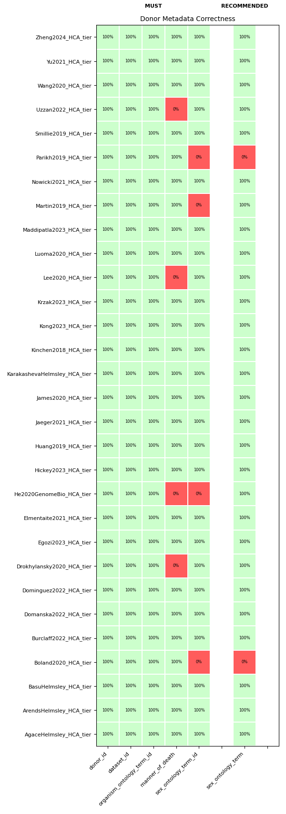
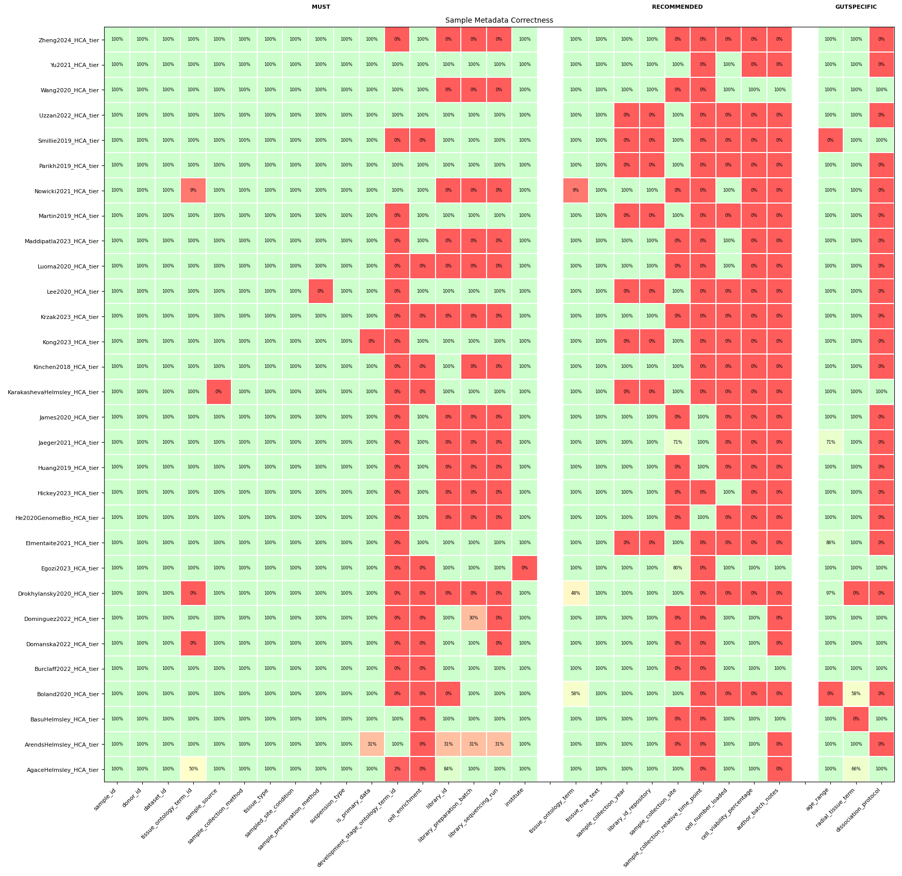

##### Contributing authors can view heatmaps here that evaluate if the metadata they provided in Google Sheets conforms to expected metadata guidelines. 

### Heatmap Descriptions

The color of each tile represents the percentage of entries for that metadata which conform to the expected standard. 

Locate your study and look across the metadata fields to determine if the metadata was entered correctly. Revise your google sheet where needed.

### Dataset-level Metadata 

```{r dataset heatmap, echo=FALSE, out.width='100%'}
knitr::include_graphics("Dataset_correctness_heatmap.png")
```


### Donor-level Metadata

```{r donor heatmap, echo=FALSE, out.width='100%'}

```

### Sample-level Metadata

```{r sample-heatmap, echo=FALSE, out.width='100%'}

```

### Celltype-level Metadata

```{r celltype-heatmap, echo=FALSE, out.width='100%'}
knitr::include_graphics("Celltype_correctness_heatmap.png")
```

<div class="footer">
  This report was generated automatically by the Integrated Gut Cell Atlas metadata team.
</div>

